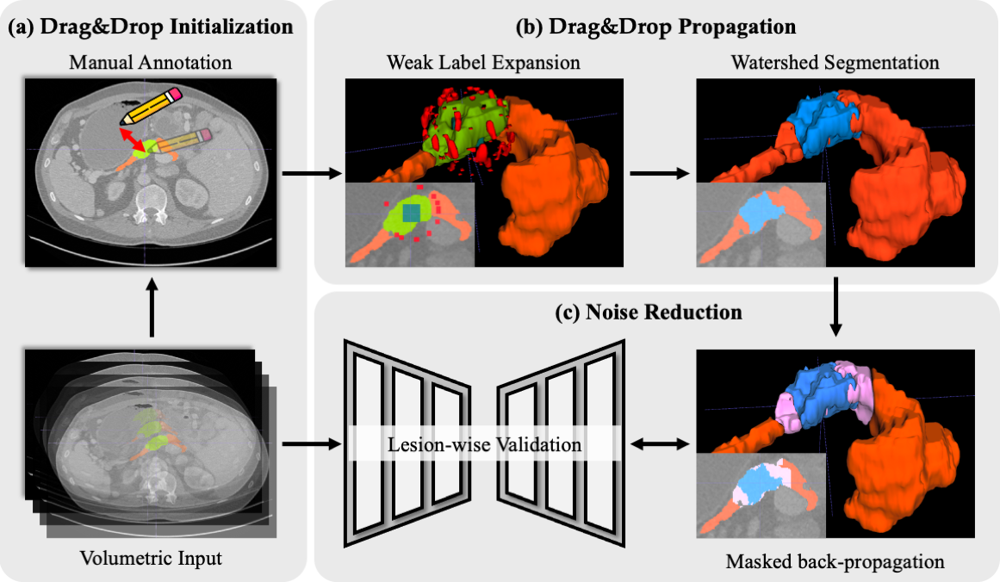
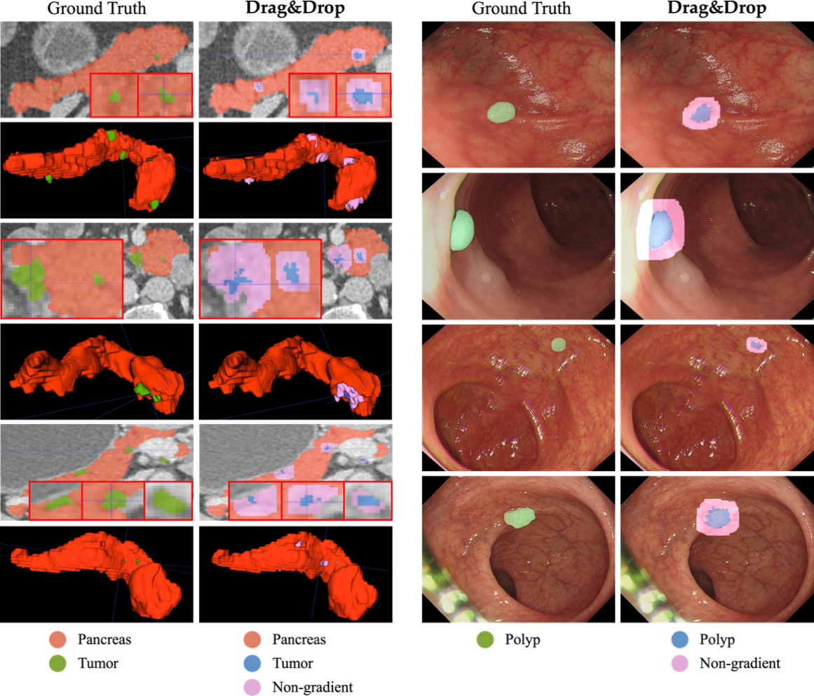

# Drag&Drop

This repository contains the codes for the paper "Acquiring Efficient Annotations for Tumor Detection and Localization in Temporal and Volumetric Medical Images".

## Table of Contents

- [1. Overview](#1-overview)
    - [1.1. Introduction](#11-introduction)
    - [1.2. Framework Overview](#12-framework-overview)
    - [1.3. Qualitative Results](#13-qualitative-results)
- [2. Quick Start](#2-quick-start)
    - [2.1. Configuring your environment](#21-configuring-your-environment)
    - [2.2. Usage](#22-usage)
    
## 1. Overview

### 1.1 Introduction

Creating large-scale and well-annotated datasets to train AI algorithms is crucial for automated tumor detection and localization. However, with limited resources, it is challenging to determine the best type of annotations when annotating massive amounts of unlabeled data. In this paper, we develop a new annotation strategy, simplifying the annotation process to Drag&Drop. 

This annotation strategy is more efficient, particularly for temporal and volumetric imaging, than other types of weak annotations, such as per-pixel, bounding boxes, scribbles, ellipses, and points. To exploit our Drag&Drop annotations, we develop a novel weakly supervised learning method based on the watershed algorithm. 

Experimental results show that our method achieves better detection and localization performance than alternative weak annotations and, more importantly, achieves similar performance to that trained on detailed per-pixel annotations. Additionally, we demonstrate that, with limited resources, allocating weak annotations from a diverse patient population can foster models more robust to unseen images than allocating per-pixel annotations for a small set of images. 


### 1.2. Framework Overview

<p align="center">
     <br />
    <em> 
    Figure 1: Annotation and propagation process of the proposed Drage&Drop. The pancreas and tumor are represented by the colors orange and green, respectively. Given the weak label, we expand it to a lesion marker (teal green) and background markers (red). We then utilize the marker-based watershed algorithm to generate the initial segmentation area (blue), following which dilated tumors (pink) are applied to compute the masked back-propagation.
    </em>
</p>


### 1.3. Qualitative Results

<p align="center">
     <br />
    <em> 
    Figure 2: Illustration of Drag&Drop annotations on the JHH and SUN-SEG datasets.
    </em>
</p>


## 2. Quick Start

### 2.1. Configuring your environment:

+ Creating a virtual environment in terminal:       

```bash
conda create -n DragDrop python=3.7
```

+ Installing necessary packages: 

```bash
pip install -r requirements.txt
```

### 2.2. Usage:

```bash
python main.py
```
